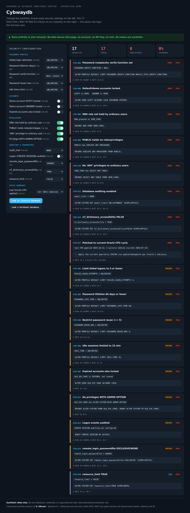
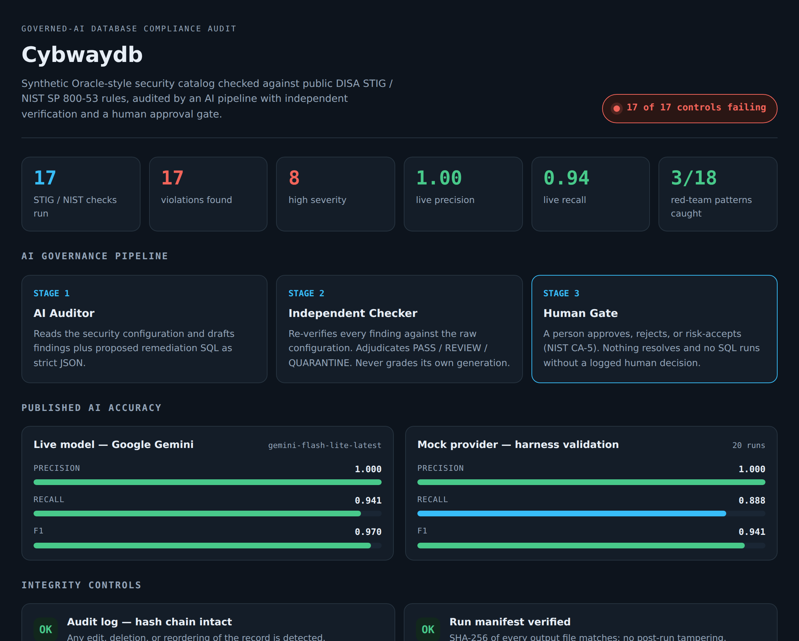
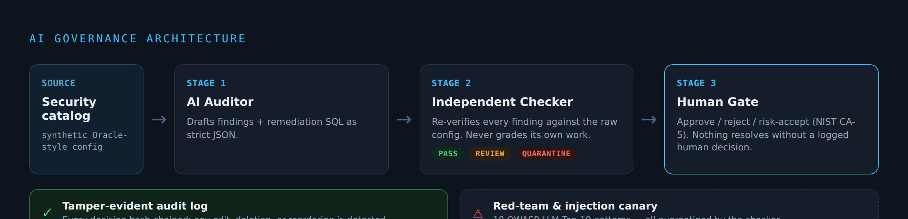

<h1 align="center">Cybwaydb</h1>

<p align="center"><b>An open-source, governed-AI database compliance auditor.</b><br>
AI reads a database's security configuration, checks it against public DISA&nbsp;STIG&nbsp;/&nbsp;NIST rules, and drafts findings &amp; remediation SQL — wrapped in a transparent AI-governance architecture with published accuracy benchmarks.</p>

<p align="center">


</p>

<p align="center"><i>A personal AI-engineering portfolio project by V. Vikram — applying database-security expertise to modern AI governance.</i></p>

---

## See it in action

Change synthetic Oracle security settings and watch all 17 compliance checks re-run live — **entirely in the browser, no API key, no cost.** ([`docs/demo.html`](docs/demo.html))



The full tool also produces a self-contained HTML audit report, including live-model accuracy and the governance pipeline:



## Why it's different

Enterprise tools (Guardium, Imperva, Oracle Data Safe) are closed platforms with no transparent AI governance. Cybwaydb is **open-source, CI/CD-pipeline-native, and publishes its own governance architecture and AI accuracy benchmarks** — the AI is measured, verified, and gated, not trusted blindly.

## The governance architecture

Every AI claim is independently re-verified, and no AI output takes effect without a logged human decision.



## Published AI accuracy

Measured against deterministic ground truth (the rule engine on the same raw config).

| Provider | Precision | Recall | F1 | Runs | Cost |
|---|---|---|---|---|---|
| **Live — Google Gemini** | **1.000** | **0.941** | **0.970** | 3 | $0.00 (free tier) |
| Mock (harness validation) | 0.999 | 0.897 | 0.945 | 50 | $0.00 |

See [`BENCHMARKS.md`](BENCHMARKS.md). Live runs are budget-capped in code ($2 hard ceiling, charged before every call).

## What's inside

- **Synthetic SQLite catalog** mimicking Oracle security views (`dba_users`, `dba_profiles`, `dba_role_privs`, `dba_sys_privs`, `v$parameter`, audit settings) — fake data only
- **17 rule checks** (CYB-001…017) citing DISA STIG rule IDs + NIST SP 800-53 controls, each with remediation SQL — including **Oracle quarterly CPU patch-currency** (PATCH-WATCH)
- **Independent checker** adjudicating PASS / REVIEW / QUARANTINE
- **Human approval gate** — approve / reject / **risk-accept** (POA&M-style, NIST CA-5, expiring)
- **Tamper-evident** hash-chained audit log + SHA-256 run manifest
- **Red-team suite** — 18 OWASP LLM Top-10-mapped injection/jailbreak/exfil patterns + an injection canary, all quarantined
- **Eval benchmark**, **drift detection**, **HTML report**, **policy-lint + secret-scan** controls
- **86 tests**, mock-mode CI ($0)

## Quick start

```bash
pip install -e ".[dev]"
pytest                                   # 86 tests, all offline, $0

cybwaydb init-db --out mydb.sqlite       # export a synthetic catalog you can edit
cybwaydb scan --db mydb.sqlite --out runs/latest   # scan your own catalog file
cybwaydb scan --out runs/latest          # or scan the built-in synthetic DB
cybwaydb report --run-dir runs/latest --out report.html   # standalone HTML dashboard

cybwaydb verify --run-dir runs/latest    # verify audit chain + manifest
cybwaydb benchmark                       # auditor precision/recall vs ground truth
cybwaydb redteam                         # prove the injection canary is caught
cybwaydb drift --old runs/prev/findings.json --new runs/latest/findings.json
```

Everything runs in **mock mode by default** — no API key, no network, no cost. The one live-model demo requires *your own* API key and explicit opt-in; CI never makes a paid call.

## Safety &amp; scope

- **Defensive only.** No offensive/exploit code. "Red-team" here means self-testing our own tool against published OWASP LLM Top 10 patterns.
- **Synthetic data only.** No real database, credential, or organizational data.
- Remediation SQL is **never auto-executed** — dry-run plus explicit human approval, logged.
- Config metadata only is ever sent to an LLM — never table data, never passwords.
- See [`LEGAL.md`](LEGAL.md) for licensing and source-material provenance.

## License

Apache-2.0 — see [`LICENSE`](LICENSE) and [`NOTICE`](NOTICE). Copyright © V. Vikram.
